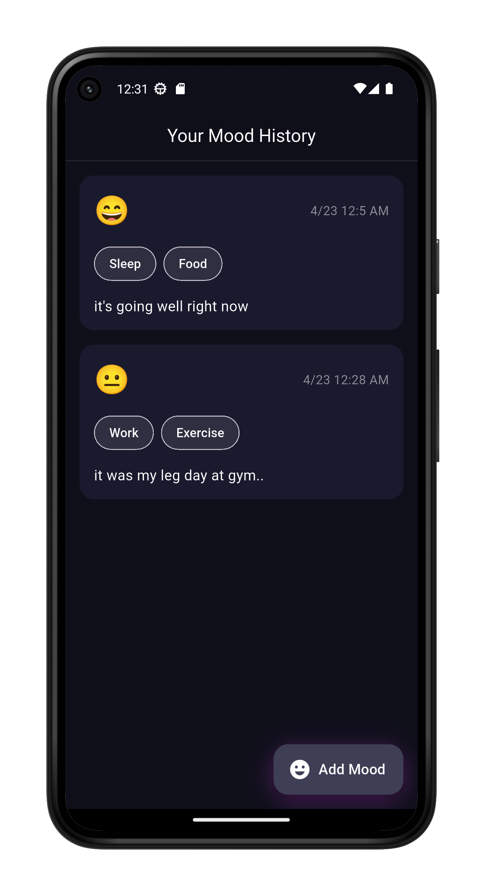
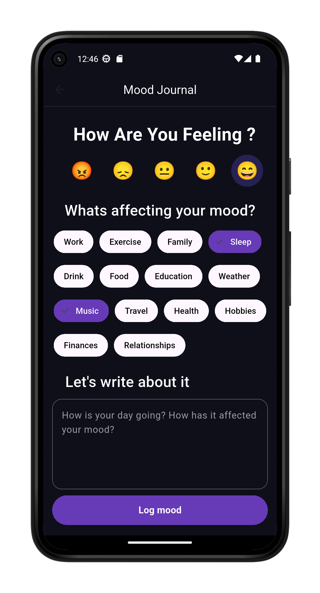

# 🧠 Mood Journal App

A clean and expressive Flutter app built to **learn and understand the `Provider` state management** technique — with a dark aesthetic, dynamic UI, and a sprinkle of emoji magic.

<p align="center">
  
  
  
</p>

---

## 🧘‍♂️ Why I Built This

This project is part of my Flutter learning journey — specifically diving deep into **`Provider`**.  
I wanted to build something that looks good *and* helps me practice clean architecture and state handling.  
The result? A mood tracker app with:

- Emoji-based mood logging
- Tagging system
- Notes with timestamp
- A floating action button to add new moods
- State management using `Provider`

---

## 📱 Screenshots

| Home Page | Add Mood |
|-----------|----------|
|  |  |


---

## 🧰 Tech Stack

- **Flutter**
- **Provider** for state management
- **Dart**
- Custom dark theme UI
- Swipe to delete (coming soon!)

---

## 📦 Features

- ✅ Add a mood with emoji, tags, and note
- ✅ Moods displayed in a scrollable list
- ✅ Persistent state with Provider
- ✅ Styled to match a cozy dark mode aesthetic
- ❌ Local storage (coming soon)
- ❌ Sentiment analysis integration (coming soon)

---

## 🚀 Getting Started

```bash
git clone https://github.com/saheelmk/Mood_Journal.git
cd mood-journal
flutter pub get
flutter run


